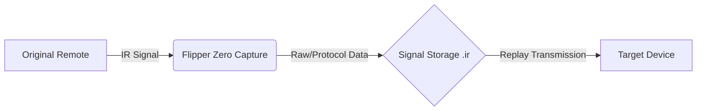
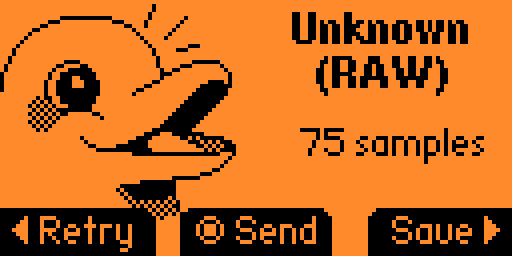
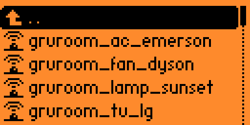
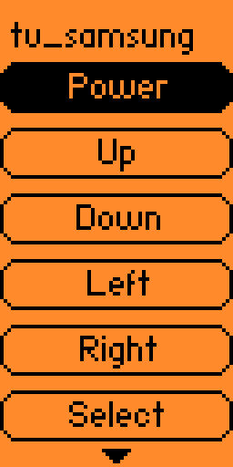
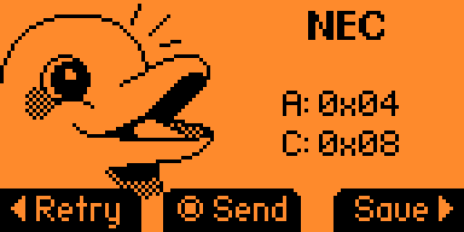

# Flipper IR Automation System — Signal Capture, Analysis & Room Control


## 📌 Project Overview

This project involves the design and implementation of a unified infrared (IR) automation system using the **Flipper Zero** device. It focuses on reverse engineering consumer remote signals, capturing and organizing IR codes, and reliably replaying them to control multiple devices within a single environment.

**Key Focus Areas:**
- **Signal Intelligence**: Capture and protocol analysis of various consumer electronics.
- **Interoperability**: Seamless control of diverse devices from a single interface.
- **Data Engineering**: Structured organization and versioning of signal data.
- **Security Research**: Controlled experimentation with signal replay and potential vulnerabilities.
- **Automation**: Repeatable workflows for room control.

---

## 📑 Table of Contents

- [Project Overview](#-project-overview)
- [Architecture & System Flow](#-architecture--system-flow)
- [Hardware & Tools](#-hardware--tools)
- [Methodology](#-methodology)
- [Demonstration & Visuals](#-demonstration--visuals)
- [Performance & Reliability](#-performance--reliability)
- [Security & Ethics](#-security--ethics)
- [Repository Structure](#-repository-structure)
- [Getting Started](#-getting-started)
- [License](#-license)

---

## 🏗 Architecture & System Flow

### High-Level Signal Flow

The system follows a linear path from signal acquisition to deployment:



### Physical Device Layout

The centralized control hub manages devices across the room:

- **LG TV** (Entertainment)
- **Samsung TV** (Entertainment)
- **Emerson AC** (Climate Control)
- **Dyson Fan** (Air Purification)
- **Sunset Lamp** (Ambiance)

*(See `diagrams/architecture.md` for detailed system flow.)*

---

## 🛠 Hardware & Tools

| Component | Description |
| :--- | :--- |
| **Flipper Zero** | Multi-tool device for radio protocols, access control, and hardware hacking. Running **Momentum firmware**. |
| **IR Transceiver** | Built-in infrared transmitter and receiver on the Flipper Zero. |
| **Original Remotes** | Manufacturer-provided remotes for initial signal capture. |
| **MicroSD Card** | Used for signal export, backup, and version control. |
| **qFlipper** | Desktop application for file management and firmware updates. |

---

## 🔬 Methodology

### 1. Signal Capture
IR signals were captured using the **Learn New Remote** function on the Flipper Zero. Each button on the original remote was pressed individually and labeled in real-time.

> **Note:** No protocol was automatically detected for most devices, so signals were stored and replayed using **RAW capture format** to ensure maximum compatibility.

### 2. Signal Labeling & Organization
All captured remotes were saved under a structured namespace: `grv_room/`. Each device was assigned a unique file with standardized naming conventions for scalability and clarity.

### 3. Signal Export & Version Control
All `.ir` files were exported from the Flipper Zero SD card and versioned into this repository to ensure reproducibility, documentation, and backup.

### 4. Testing & Validation
Each signal was replayed multiple times at varying distances and angles to validate reliability, range, and accuracy.

---

## 📸 Demonstration & Visuals

The following demonstrations validate the system's functionality and user interface.

### 1. IR Signal Capture Interface (RAW Mode)
The screen shows RAW infrared signal capture. Since no protocol was auto-detected, signals were recorded in RAW mode.


### 2. Saved Remote Profiles
Captured remotes are stored under a structured naming convention for easy navigation.



### 3. Device Control Interface (Samsung TV Example)
Demonstrates directional navigation and power control using captured IR signals.



### 4. Protocol Detection (NEC Example)
Some devices exposed protocol-level decoding (NEC), displaying address and command values.



---

## 📊 Performance & Reliability

| Metric | Observation | Notes |
| :--- | :--- | :--- |
| **Effective Range** | 5–6 feet | Dependent on device receiver sensitivity. |
| **Accuracy** | 100% | Successful replay on all tested attempts. |
| **Angle Sensitivity** | Low | Minor sensitivity observed with the Sunset Lamp. |
| **Latency** | Instantaneous | No perceptible delay between button press and action. |
| **Replay Failures** | None | Consistent performance across sessions. |

### Technical Findings
- **RAW vs. Decoded**: RAW IR capture ensures maximum compatibility but increases file size.
- **Line of Sight**: Direct line-of-sight significantly improves reliability, especially for the Sunset Lamp.
- **Naming Conventions**: Consistent naming is critical for long-term scalability and automation.

---

## 🔐 Security & Ethics

This project emphasizes a **security-conscious experimentation mindset**. For more details on how to report security vulnerabilities, please see our [Security Policy](SECURITY.md).

- **Authorized Environment**: All devices used are personally owned and located within a controlled environment (my room).
- **Controlled Signal Capture**: Signals were captured only from authorized remotes.
- **Data Integrity**: Focus on maintaining accurate and unaltered signal data.
- **Ethical Boundaries**: No unauthorized devices or environments were accessed or targeted.

> **Disclaimer**: This repository is intended strictly for educational, research, and engineering demonstration purposes.

---

## 📂 Repository Structure

```
.
├── data/ir_captures/   # Raw IR capture files (.ir)
├── demo/               # Demonstration images and assets
├── diagrams/           # System architecture and flow diagrams
├── notes/              # Engineering notes and findings
├── LICENSE             # MIT License
└── README.md           # Project documentation
```

---

## 🚀 Getting Started

To use the captured IR signals:

1.  **Clone the Repository**:
    ```bash
    git clone https://github.com/yourusername/flipper-ir-automation.git
    ```
2.  **Transfer Files**:
    - Connect your Flipper Zero via USB.
    - Open **qFlipper**.
    - Navigate to `SD Card/infrared/`.
    - Copy the `grv_room` folder from `data/ir_captures/` to this location.
3.  **Usage**:
    - On your Flipper Zero, go to **Infrared** -> **Saved Remotes**.
    - Select `grv_room` and choose the desired device.

---

## 📜 License

This project is licensed under the MIT License - see the [LICENSE](LICENSE) file for details.

Copyright (c) 2026 Gurvin Singh
