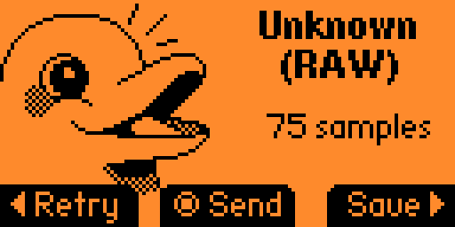
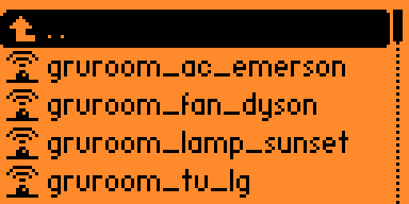
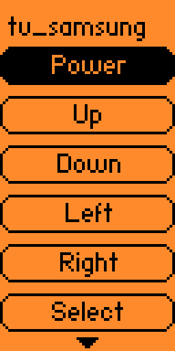
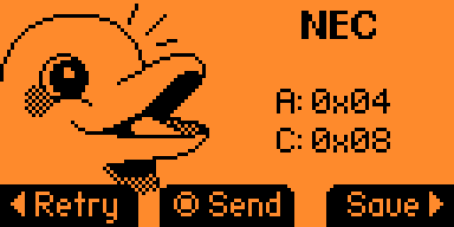

# Demonstrations — IR Automation System

This document provides visual validation of the infrared (IR) automation system built using Flipper Zero. All demonstrations were conducted in a controlled, authorized environment using personally owned devices.

---

## 🎯 Demonstration Objectives

- Validate accuracy of captured IR signals  
- Verify real-world usability and reliability  
- Demonstrate multi-device control from a single interface  
- Confirm replay success across different angles and distances  

---

## 📸 Test Environment

**Location:** Personal Lab / Bedroom  
**Distance Tested:** 3–6 feet  
**Line of Sight:** Required  

**Devices Tested:**
- LG TV  
- Samsung TV  
- Emerson Air Conditioner  
- Dyson Pure Cool Link  
- Sunset Projection Lamp  

---

## 🖼 Screenshot Demonstrations

### 1. IR Signal Capture Interface (RAW Mode)

This screen shows RAW infrared signal capture using Flipper Zero.  
No protocol was auto-detected, so signals were recorded and replayed using RAW mode for maximum compatibility.

---

### 2. Saved Remote Profiles

Captured remotes stored under a structured naming convention for easy navigation and reuse.

---

### 3. Device Control Interface (Samsung TV Example)

Demonstration of directional navigation and power control using captured IR signals.

---

### 4. Protocol Detection (NEC Example)

Some devices exposed protocol-level decoding (NEC), displaying address and command values.

---

## 🧪 Functional Test Results

| Test Case | Result |
|-------------|----------|
| Power toggle | 100% success |
| Volume control | Instant response |
| AC temperature control | Accurate |
| Fan speed adjustment | Immediate |
| Lamp brightness & color | Accurate |
| Multi-device switching | No signal collision |

---

## 📏 Range & Angle Testing

| Test Condition | Result |
|----------------|----------|
| 3 feet | Excellent reliability |
| 5 feet | Optimal working range |
| 6 feet | Minor alignment sensitivity |
| Off-angle | Sunset lamp required precise alignment |

---

## 🔍 Observations

- RAW IR capture provided maximum device compatibility.
- NEC protocol decoding was detected for some devices.
- Line-of-sight improved reliability.
- Sunset lamp required more precise aiming compared to other devices.

---

## 🧠 Engineering Validation

Screenshots confirm:

- Accurate IR signal capture  
- Reliable replay transmission  
- Consistent real-world usability  
- Successful automation potential  

---

## ⚠️ Safety & Authorization

All demonstrations were conducted using personally owned devices.  
No third-party or unauthorized systems were accessed.

---
