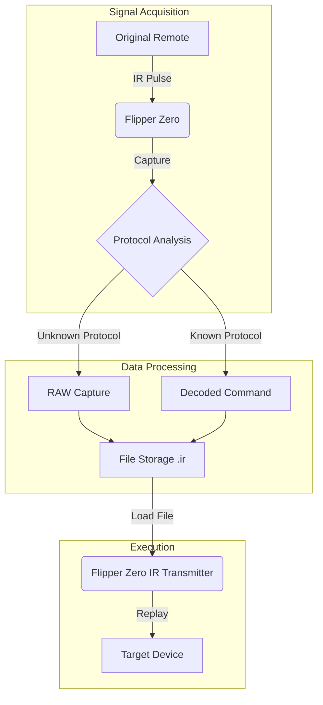

# System Architecture — IR Automation Lab

## 🔭 Overview

This system enables centralized control of multiple consumer devices using a single Flipper Zero unit by capturing, analyzing, and replaying infrared (IR) signals. The architecture is designed for modularity, allowing new devices to be added without disrupting the existing control flow.

---

## 🏗 High-Level Architecture

The system operates on a linear flow from signal acquisition to deployment.



---

## 🎮 Device Ecosystem

The system currently manages a diverse set of appliances within a single physical environment.

| Device Category | Manufacturer | Model / Type | Protocol |
| :--- | :--- | :--- | :--- |
| **Climate** | Emerson | Window AC Unit | RAW |
| **Air Quality** | Dyson | Pure Cool Link | RAW |
| **Entertainment** | LG | Smart TV | NEC / RAW |
| **Entertainment** | Samsung | Smart TV | NEC / RAW |
| **Ambiance** | Generic | Sunset Lamp | RAW |

---

## 📡 Signal Flow & Logic

### 1. Acquisition Phase
- **Input**: Physical button press on the original manufacturer remote.
- **Receiver**: Flipper Zero internal IR receiver (38kHz carrier frequency).
- **Process**: The signal is demodulated. If a standard protocol (like NEC or RC5) is matched, it is decoded. Otherwise, the raw timing of pulses is recorded.

### 2. Storage Phase
- **Format**: `.ir` text files.
- **Structure**:
    ```text
    Filetype: IR signals file
    Version: 1
    # ...
    name: Power_On
    type: raw
    frequency: 38000
    duty_cycle: 0.330000
    data: 9000 4500 560 560 ...
    ```
- **Organization**: Grouped by room and device type (e.g., `data/ir_captures/grv_room/`).

### 3. Replay Phase
- **Trigger**: User selection via Flipper Zero UI.
- **Transmission**: The saved timing data is modulated onto a 38kHz carrier wave and emitted via the IR LEDs.
- **Target**: The device's IR receiver detects the train of pulses and executes the command.

---

## 📐 Physical Constraints & Reliability

### Line of Sight (LoS)
Infrared technology requires a direct line of sight between the transmitter and receiver.
- **Optimal Range**: 2–5 meters.
- **Beam Angle**: ~30° cone from the Flipper Zero.

### Interference Factors
- **Sunlight**: Direct sunlight can saturate IR receivers, reducing range.
- **Obstructions**: Physical objects (furniture, glass) block the signal.

### Mitigation Strategies
- **Positioning**: The Flipper Zero is centrally located to maximize coverage.
- **RAW Mode**: Using RAW captures bypasses potential decoding errors in proprietary protocols, ensuring higher reliability for obscure devices like the Sunset Lamp.
